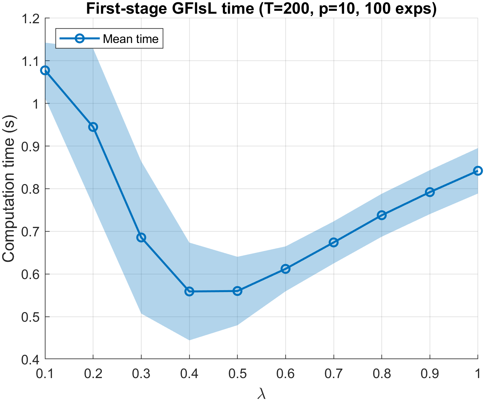
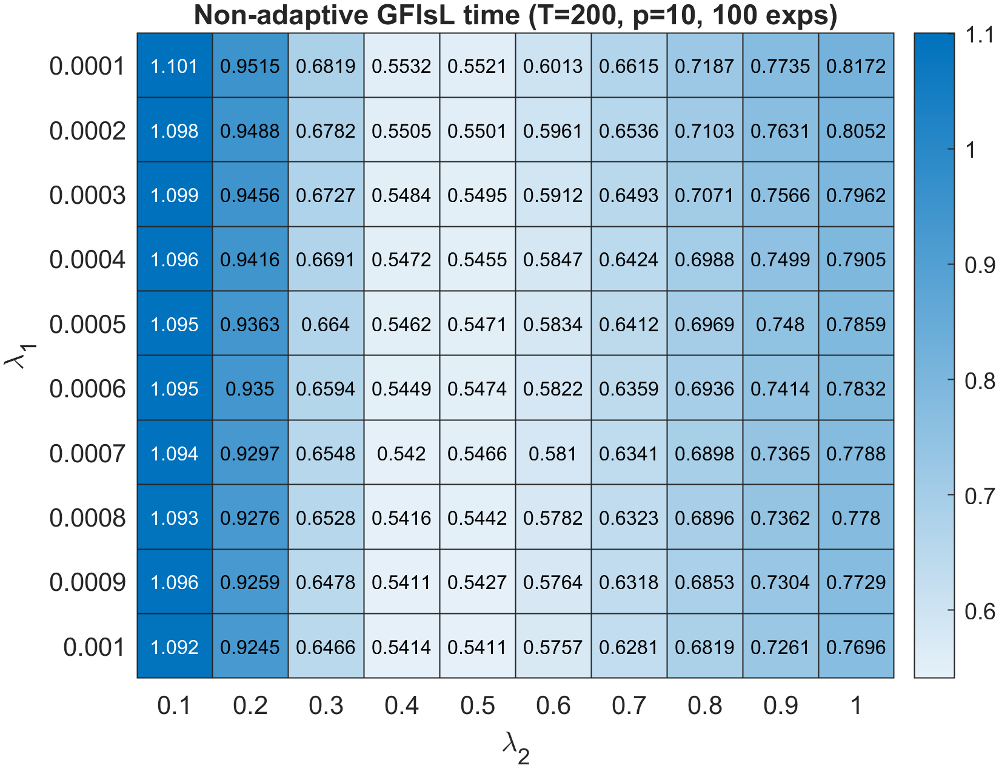
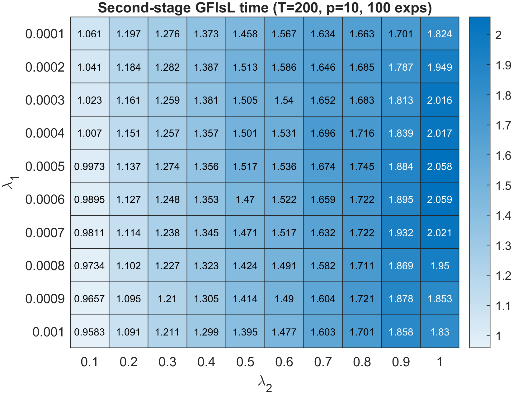
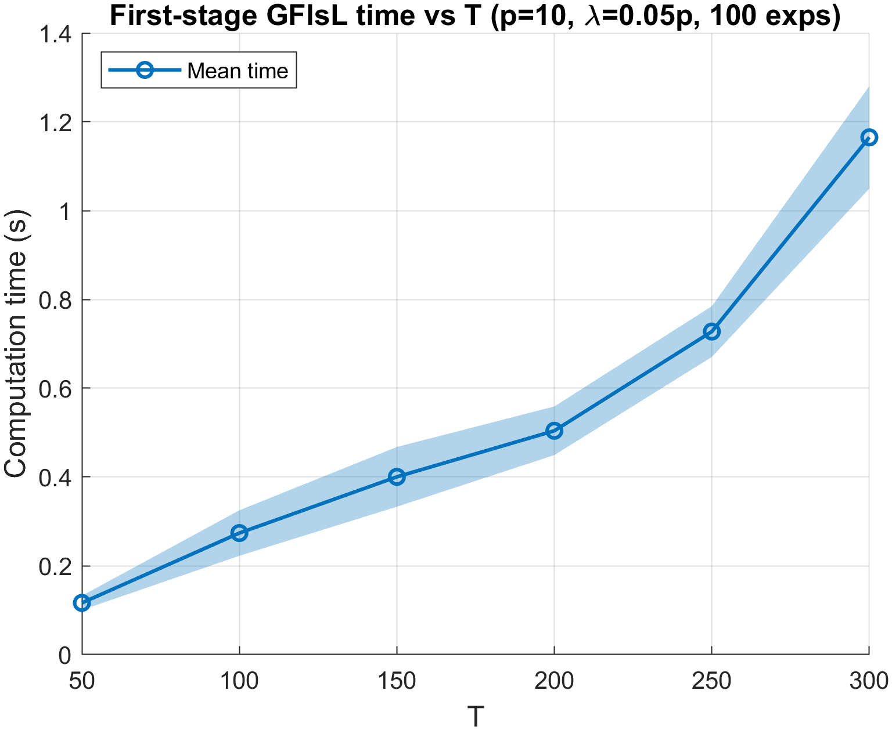
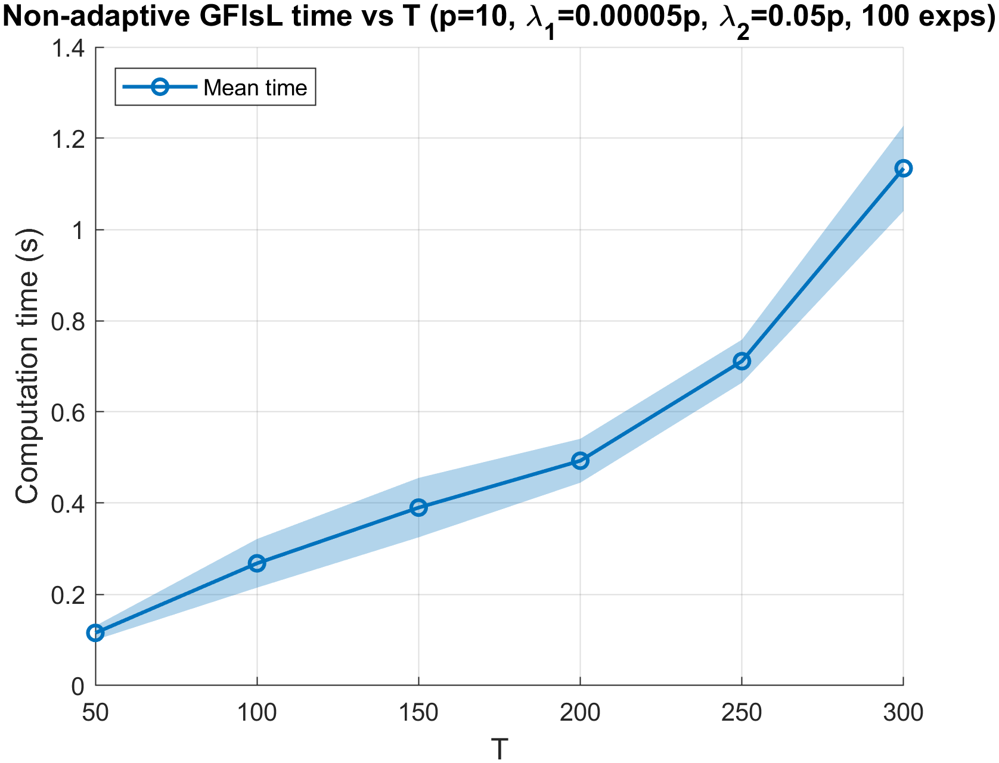
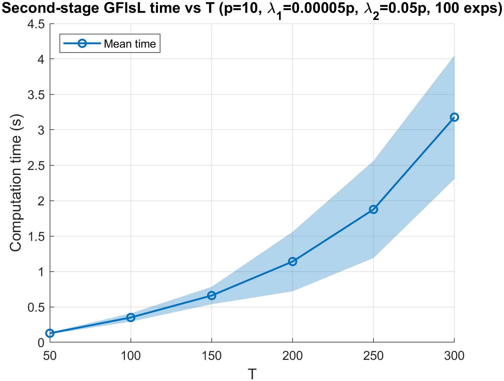
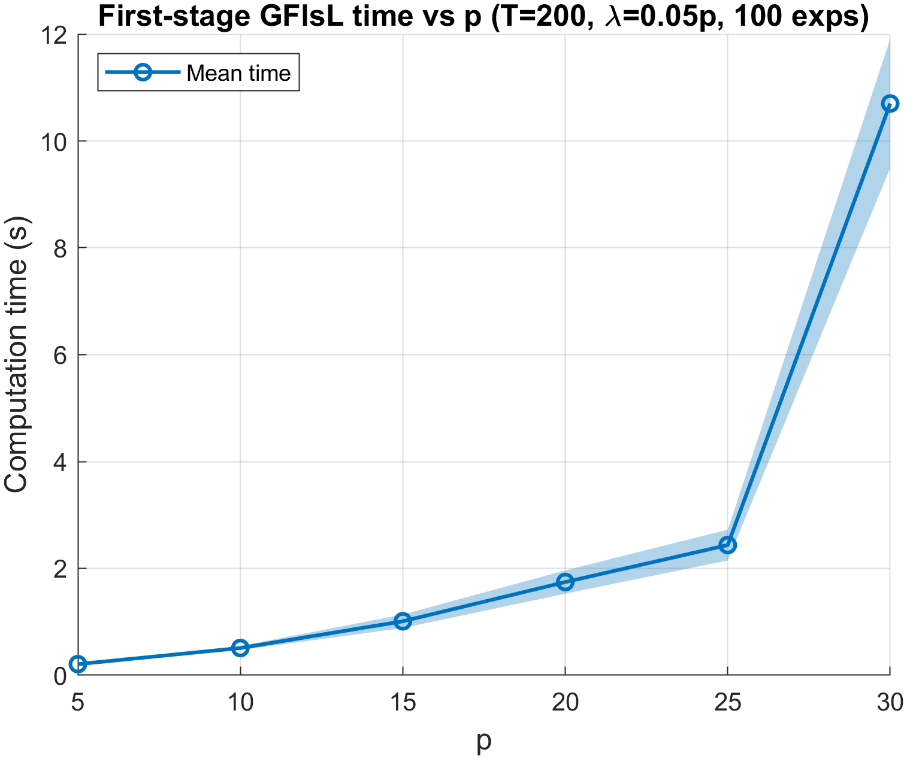
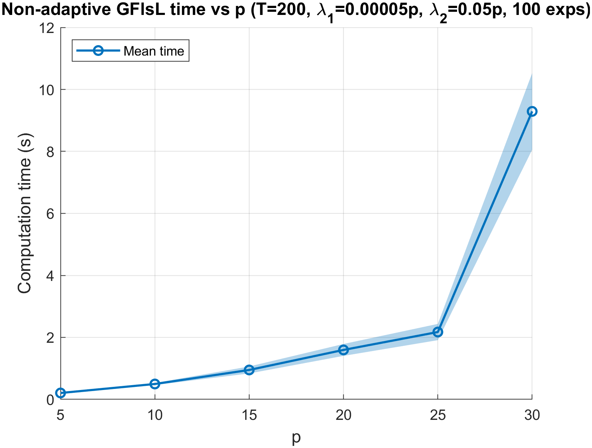
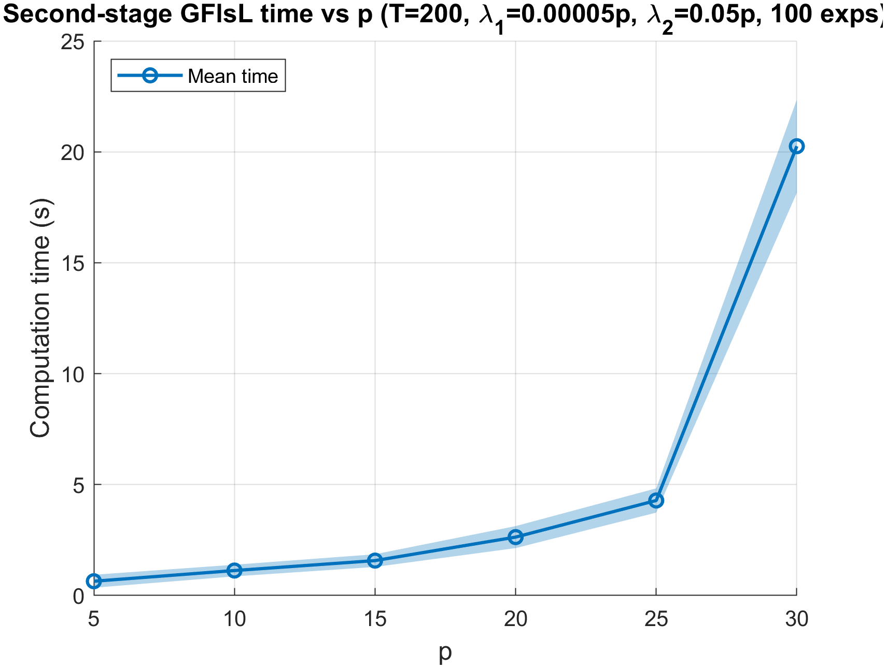

# Empirical Computational Complexity

We empirically examine the computational complexity of GFlsL under **Setting (i)** with $m^\ast=1$, recording wall-clock time (in seconds) averaged over 100 replications for three estimator configurations:
(a) the first-stage estimator (Eq. 17), depending only on $\lambda$;
(b) the non-adaptive estimator, depending on $(\lambda_1, \lambda_2)$;
and (c) the second-stage adaptive estimator (Eq. 18), which takes as input a first-stage solution whose estimated number of change points is at least $m^\ast$ and closest to it, then solves over the $(\lambda_1, \lambda_2)$ grid.
We first study how computation time varies with the tuning parameters at $(T, p) = (200, 10)$, then examine the scaling behavior as $T$ and $p$ increase separately.
The tuning grids are $\lambda_1 \in p \times \{10^{-5}, 2 \times 10^{-5}, \ldots, 10^{-4}\}$ and $\lambda_2 \in p \times \{10^{-2}, 2 \times 10^{-2}, \ldots, 10^{-1}\}$, each containing 10 equally spaced values; the adaptive-weight parameters $a_T$, $\mu_1$, and $\mu_2$ are set as in the synthetic experiments.

## First-stage computation time

The first-stage computation time as a function of $\lambda$ is shown below.
The curve is non-monotone: the average time decreases from $1.08$ seconds at $\lambda = 0.1$ to approximately $0.56$ seconds near $\lambda = 0.4\text{--}0.5$, then rises to $0.84$ seconds at $\lambda = 1.0$.
This pattern reflects the number of detected change points: small $\lambda$ values produce many change points and are computationally more expensive, while large $\lambda$ values require more iterations to converge.

## Non-adaptive and second-stage adaptive computation times

The computation times for the non-adaptive and second-stage adaptive estimators as heatmaps over the $(\lambda_1, \lambda_2)$ grid are presented below.

For the non-adaptive estimator, computation time peaks at small $\lambda_2$ (approximately $1.10$ seconds), reaches its minimum near $\lambda_2 = 0.4\text{--}0.5$ (approximately $0.54$ seconds), and rises again as $\lambda_2$ approaches $1.0$; variation along the $\lambda_1$ direction is mild.

The second-stage adaptive estimator exhibits a different pattern: for each fixed $\lambda_1$, computation time increases broadly monotonically with $\lambda_2$, ranging from approximately $0.96$ to $2.06$ seconds, while larger $\lambda_1$ values reduce the runtime slightly.

Across all three configurations, every tuning-parameter combination completes in at most approximately $2.1$ seconds on average, confirming that GFlsL remains computationally tractable over the full tuning grid.

| Non-adaptive estimator | Second-stage (adaptive) estimator |
|:---:|:---:|
|  |  |

*Computation time (in seconds) over $(\lambda_1, \lambda_2)$ ($T = 200$, $p = 10$, $m^\ast = 1$), averaged over 100 replications.*

## Scaling with problem size

We next examine how computation time scales with problem size by fixing representative tuning parameters ($\lambda = 0.05p$ for the first stage; $\lambda_1 = 5 \times 10^{-5} p$, $\lambda_2 = 0.05p$ for the non-adaptive and adaptive stages) and varying $T$ and $p$ separately.

### Scaling with $T$

Computation time as a function of $T \in \{50, 100, 150, 200, 250, 300\}$ with $p = 10$ fixed:
All three estimators exhibit monotonically increasing runtime: the first-stage and non-adaptive runtimes grow from approximately $0.12$ seconds at $T = 50$ to $1.17$ and $1.13$ seconds at $T = 300$, respectively, while the second-stage adaptive runtime increases more steeply from $0.13$ to $3.18$ seconds.
This scaling is consistent with the $O(T)$ per-iteration cost of solving the tridiagonal system, with the adaptive stage carrying the largest constant factor due to the weight computation.

| First-stage | Non-adaptive | Second-stage adaptive |
|:---:|:---:|:---:|
|  |  |  |

*Computation time (in seconds) as a function of $T$ with $p = 10$ fixed, averaged over 100 replications. Shaded bands: $\pm 1$ standard deviation.*

### Scaling with $p$

Computation time as a function of $p \in \{5, 10, 15, 20, 25, 30\}$ with $T = 200$ fixed:
The growth is sharply superlinear in $p$: runtimes increase from $0.21$, $0.21$, and $0.64$ seconds at $p = 5$ to $10.70$, $9.29$, and $20.25$ seconds at $p = 30$ for the first-stage, non-adaptive, and adaptive estimators, respectively.
This behavior reflects the $O(p^2)$ cost arising from the $p(p+1)/2$ independent tridiagonal subsystems and the eigendecomposition in the $V_t$ update.

| First-stage | Non-adaptive | Second-stage adaptive |
|:---:|:---:|:---:|
|  |  |  |

*Computation time (in seconds) as a function of $p$ with $T = 200$ fixed, averaged over 100 replications. Shaded bands: $\pm 1$ standard deviation.*
