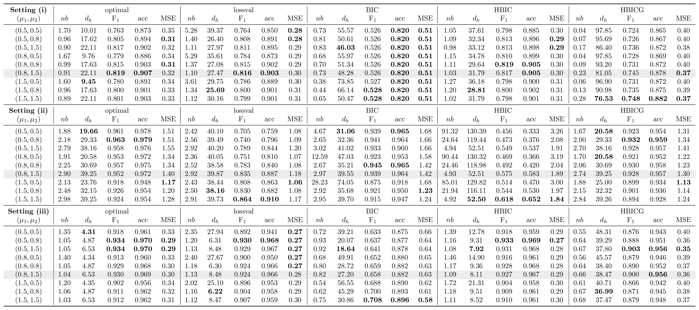
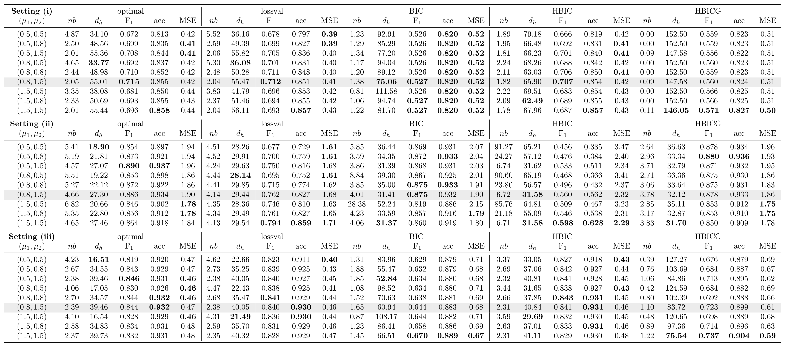

# Sensitivity to Adaptive Weight Exponents

The adaptive weights depend on the exponents $\mu_1$ (element-wise shrinkage) and $\mu_2$ (temporal-difference shrinkage), in addition to the threshold floor $a_T := T^{-\iota}$.
In this subsection, we examine the sensitivity of the adaptive estimator to $(\mu_1, \mu_2)$ with $\iota = 0.5$ fixed, and assess whether the default choice $(\mu_1, \mu_2) = (0.8, 1.5)$ adopted throughout our applications, provides robust performance.
We consider $\mu_1 \in \{0.5, 0.8, 1.5\}$ and $\mu_2 \in \{0.5, 0.8, 1.5\}$, yielding nine configurations per scenario, with $T = 200$, $p = 10$, and $m^\ast \in \{1, 3\}$ across the three data generating processes described in the simulation settings.
For each configuration, we report the five metrics averaged over 100 independent experiments under the five selection criteria (optimal, lossval, BIC, HBIC, HBICG).
Tables 1 and 2 report the results for $m^\ast = 1$ and $m^\ast = 3$, respectively, with the default row $(\mu_1, \mu_2) = (0.8, 1.5)$ shaded.

## Table 1: Sensitivity for $m^\ast = 1$

Sensitivity of the adaptive estimator to $(\mu_1, \mu_2)$ for $m^\ast = 1$ ($T = 200$, $p = 10$), averaged over 100 replications. The default row $(\mu_1, \mu_2) = (0.8, 1.5)$ is shaded; **bold** marks the best value within each column.

## Table 2: Sensitivity for $m^\ast = 3$

Sensitivity of the adaptive estimator to $(\mu_1, \mu_2)$ for $m^\ast = 3$ ($T = 200$, $p = 10$), averaged over 100 replications. The default row $(\mu_1, \mu_2) = (0.8, 1.5)$ is shaded; **bold** marks the best value within each column.

## Discussion

Tables 1 and 2 reveal that the two exponents play distinct and interpretable roles.

The fusion exponent $\mu_2$ governs the degree to which consecutive covariance estimates are fused: larger $\mu_2$ penalizes temporal differences more aggressively, suppressing spurious breaks at the cost of potentially missing genuine ones.
This effect is most visible in **Settings (i)** and **(iii)** when $m^\ast=3$.
In **Setting (i)**, increasing $\mu_2$ from $0.5$ to $1.5$ with $\mu_1=0.8$ fixed reduces the detected break count under the optimal criterion from $4.65$ to $2.05$ and raises $d_h$ from $33.77$ to $55.01$; a parallel pattern appears in **Setting (iii)**, where the optimal $d_h$ increases from $17.05$ to $39.46$ over the same $\mu_2$ range.
When $m^\ast=1$, the sensitivity to $\mu_2$ is attenuated: in **Setting (i)**, the optimal $d_h$ varies only between $9.76$ and $22.11$ across all nine configurations, and $\text{F}_1$ remains in the range $0.76$-- $0.82$ .

The sparsity exponent $\mu_1$ controls the degree of sparsity-adaptive shrinkage applied to individual covariance entries.
Larger $\mu_1$ strengthens the penalization of entries with small initial magnitude, which can improve support recovery up to a point but eventually over-shrinks genuinely non-zero entries.
This non-monotonicity is evident in **Setting (i)** with $m^\ast=1$ under the optimal criterion at $\mu_2=1.5$: $\text{F}_1$ peaks at $\mu_1=0.8$ ($0.819$) and declines to $0.801$ at $\mu_1=1.5$, while MSE increases from $0.32$ to $0.33$.
A similar pattern holds in **Setting (iii)** with HBIC and $m^\ast=3$ at $\mu_2=1.5$: $\text{F}_1$ is $0.841$ at both $\mu_1=0.5$ and $\mu_1=0.8$ but drops to $0.829$ at $\mu_1=1.5$, with MSE rising from $0.45$ to $0.48$.
Excessively large $\mu_1$ thus degrades both support recovery and estimation accuracy, confirming that $\mu_1=0.8$ occupies a favorable intermediate position.

In contrast, **Setting (ii)** is largely insensitive to $(\mu_1,\mu_2)$.
Under HBICG with $m^\ast=3$, the $\text{F}_1$ scores vary by less than $0.03$ and $d_h$ by less than $5$ across all nine configurations.
This stability reflects the regularity of the banded structure, which does not require aggressive adaptive shrinkage to achieve good performance.

The default $(\mu_1,\mu_2)=(0.8,1.5)$ thus represents a deliberate compromise.
Setting $\mu_2=1.5$ provides sufficient temporal regularization to prevent over-segmentation, a priority in practice where the true $m^\ast$ is unknown, while $\mu_1=0.8$ delivers effective sparsity-adaptive shrinkage without the over-penalization that arises at $\mu_1=1.5$.
As the shaded rows confirm, this configuration achieves competitive or near-best $d_h$, $\text{F}_1$, $\text{acc}$, and MSE across both $m^\ast=1$ and $m^\ast=3$ under the practical criteria HBIC and HBICG in all three settings, establishing it as a robust default when the true change-point structure and covariance sparsity are unknown.
